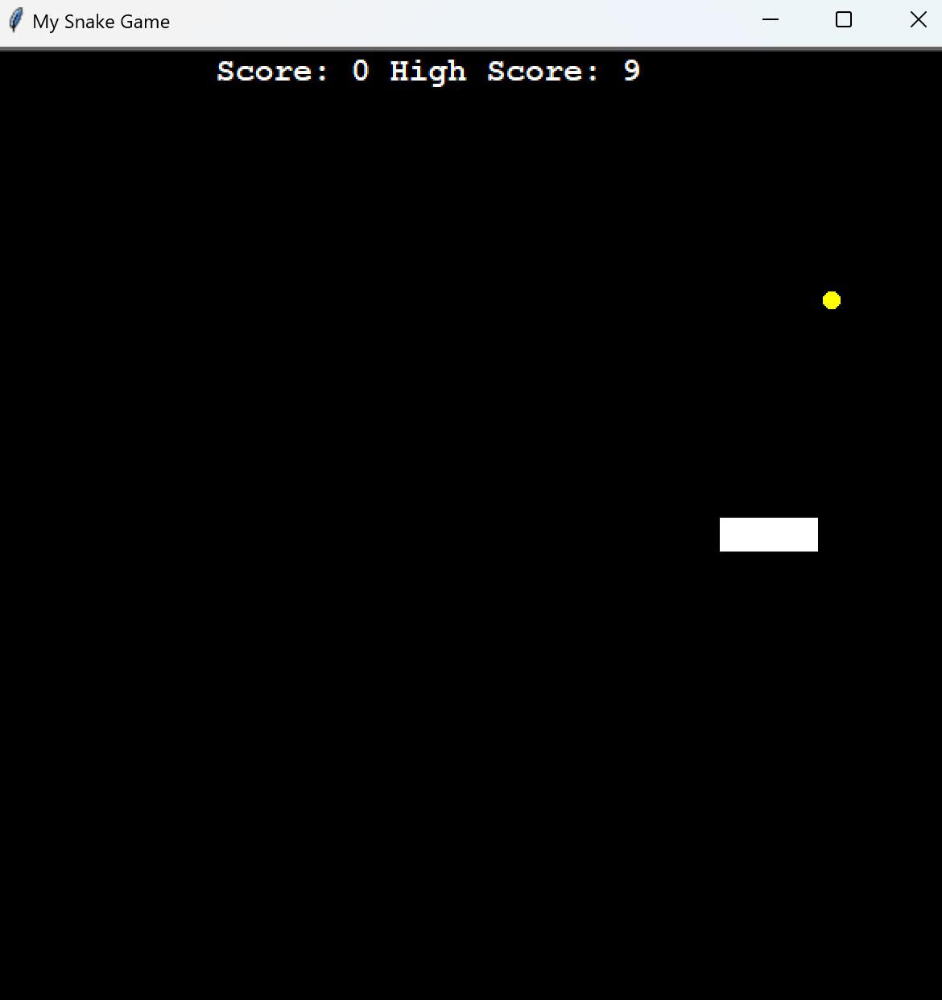

# Snake game in Python :snake:

This repository is based on the Snake, originated in 1976. It follows the 100 Days of Code **Python** course by Angela Yu on Udemy.

### Features
It uses the Turtle module from Python and the concept of *class inheritance* and Object-Oriented Programming.

### How to Play
You can play by downloading the executable file.  
Control the Snake by tapping the *arrow keys* on your Keyboard to eat food and grow longer.

  

By the way...
**Polar bears live**  *(Arctic Region, the North Pole)* **in the opposite side of the Earth from penguins** *(Southern Hemisphere, Antarctic, the South Pole)*, **so they never get to meet each other** 🐻‍❄️bear: - :penguin: 
